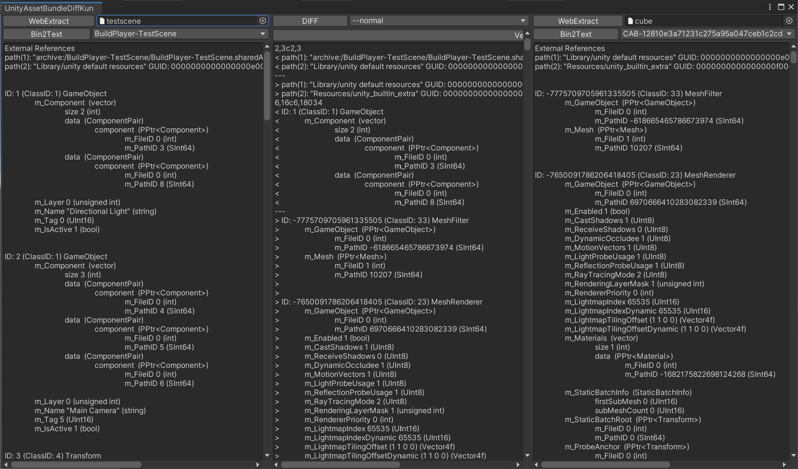

# UnityAssetBundleDiffKun
AssetBundleの中身に対して差分を比較する為のEditor拡張

## 概要

- 何故だか判らないが、誰も変更を加えていないのに、AssetBundleが更新されてしまった
- 前回ビルドとしたAssetBundleと今回ビルドしたAssetBundleの差分を知りたい

これは、AssetBundleの中身を比較してその変更差分を知る為のEditor拡張です。



## インストール

UnityAsseBundleDiffKunは別途[UnityCommandLineTools](https://github.com/katsumasa/UnityCommandLineTools)を必要とします。
本リポジトリと合わせてUnityCommandLineToolsを取得して下さい。

```
git clone https://github.com/katsumasa/UnityAssetBundleDiffKun.git
git clone https://github.com/katsumasa/UnityCommandLineTools.git
```

## 使い方

`Window > UnityAssetBundleDiffKun`でEditorWindowを起動します。
比較を行いたい二つのAssetBundleをそれぞれ左右のObject Fieldへ指定します。

- [Object Field] 比較を行うAssetBundleを左右のそれぞれの[Object Field]へ設定します。
- [WebExtract] AssetBundleを展開します。
- [Popup選択フィールド] AssetBundleに含まれていたAssetの一覧が表示選択可能です。
- [Bin2Text] 展開されたいたAssetBundleに含まれているAssetをPopupから選択し、テキスト形式に変換して表示します。
- [Diff] 左右のViewで表示されているAssetの差分を表示します。選択用PullDownMenuからdiff実行時のオプションを指定することで表示形式を変更することが出来ます。
- [Verify] 左右に設定したAssetBundleの含まれているAssetを順に比較します。

## 参考URL

https://support.unity3d.com/hc/en-us/articles/217123266-How-do-I-determine-what-is-in-my-Scene-bundle-
